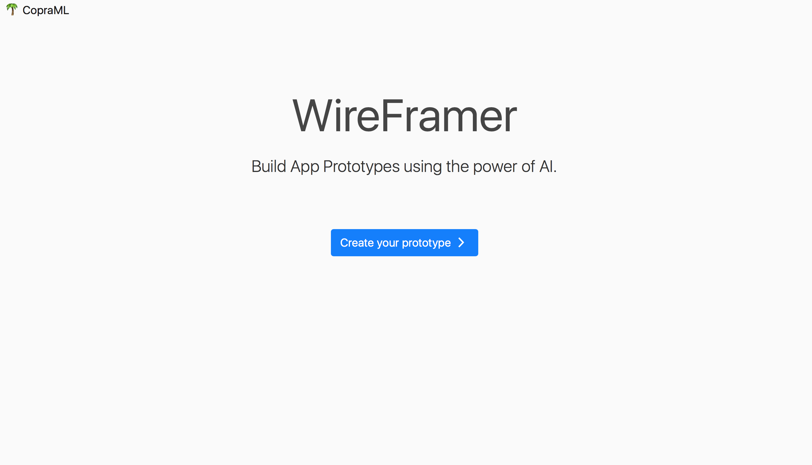
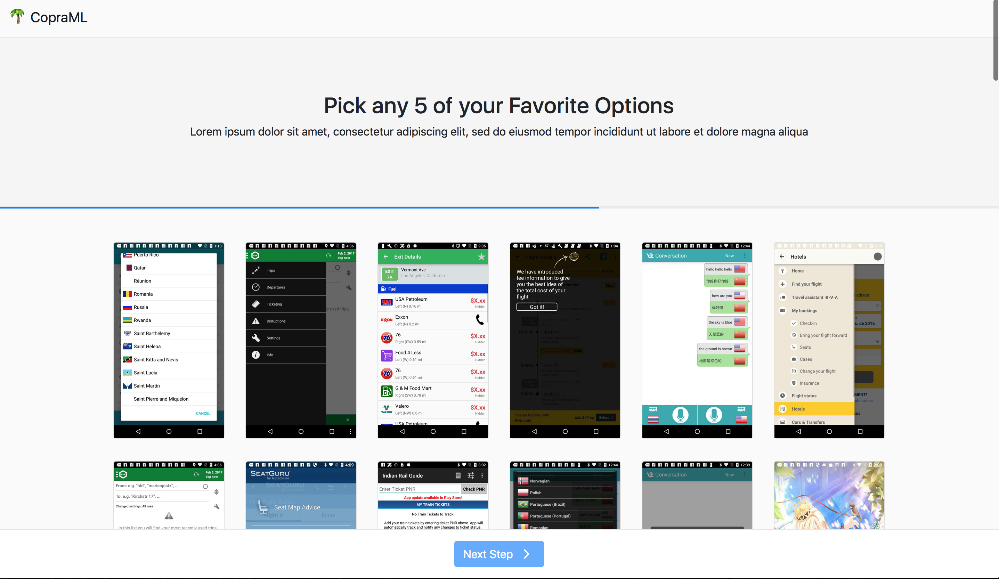
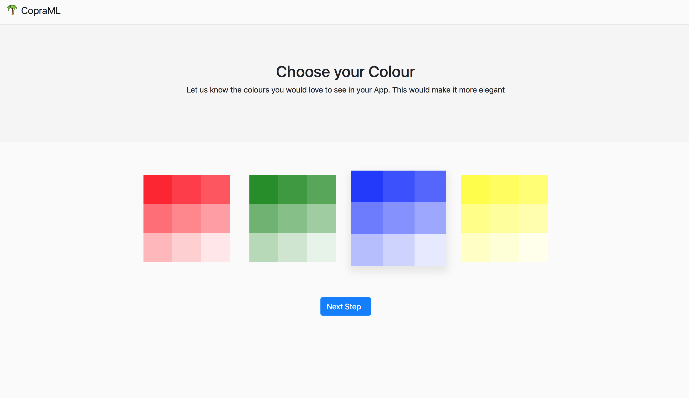

# copraML AppPrototyper
Build App Prototypes using the Power of Deep Learning Based AI

### What if making an app prototype is as easy as selecting some images?

We have tried to solve exactly this based on a easy to use process, where the user selects the type of the application he would like to begin with, eg: Social or Travel app and then chooses a couple of UI screens and a basic colour palette. The webapp then makes predictions based on the selected screens and the colour palette to suggest them a UI prototype which is visually appealing and readily presentable

We use a rich dataset having more than 70,000 UI Screens from various apps on the play store. The Dataset can be found here : [http://interactionmining.org/rico](http://interactionmining.org/rico)

We use the trained vectors from a Deep Convolutional Autoencoder to find semantically similar images to the ones selected by the users.

We also have custom classifiers for different Views for Android Apps - ListView, CardView and GridView. These provide the parameters like optimal size, position and colour for the UI screens. We use a custom Convolutional Neural Network roughly based on the VGG architechture.

This information is then fed to the templating system which builds a visually appealing prototype for the user

There is a lot of possibility for extension, and we have just scratched the surface of the possibilities in this Hackathon.

Thank you!
